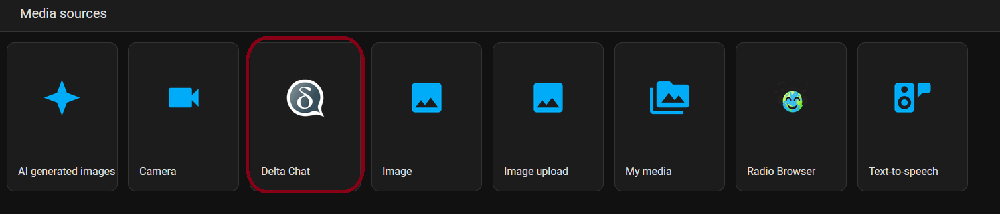
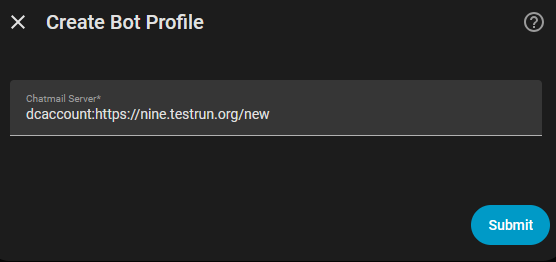
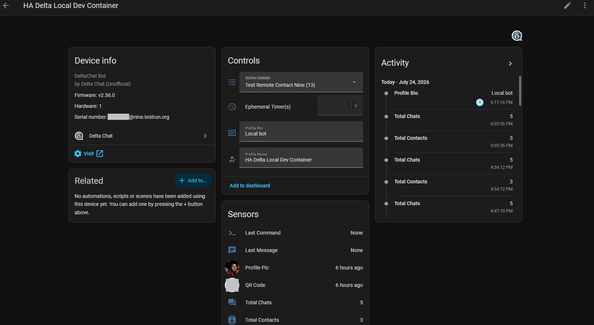

# Delta Chat Integration for Home Assistant

An **unofficial** Home Assistant integration that allows you to use Delta Chat as a notification and interaction engine. Leverage the power of decentralized, e-mail-based messaging to control your smart home securely.

> [!IMPORTANT]  
> **Disclaimer**: This is an **unofficial** integration. It is not developed, maintained, or endorsed by the official Delta Chat team.


## 🚀 Features

*   **Instant Notifications**: Send alerts from Home Assistant to your Delta Chat app (individuals or groups).
    * Via Notifier (Using the notifier entity created by the Delta Chat Integration). This will use the "Active Contact" Control Dropdown to pick which chat(Contact / Group) to send the message to.
      ```yaml
      action: notify.send_message
      target:
        entity_id: notify.delta_chat_none
      data:
        message: Test Message
      ```

    * Via Send Message Action
      ```yaml
      action: deltachat.send_message
      data:
        // ID of integration. Use the UI mode in developer tools to get this ID
        from_account: 01FFFFFFFFFFFFFFFFFFFFFFFF 
        // Chat ID
        target: "12" 
        message: Test Message
      ```

*   **Two-Way Interaction**: Send commands from Delta Chat back to Home Assistant to trigger scripts or automations.
    * Use the `deltachat_message_received` event 
      ```yaml
      event_type: deltachat_message_received
      data:
        to: XXXXXXXXX@nine.testrun.org
        to_name: HA DeltaChat Test Bot
        text: Sample incoming message
        sender: 11
        chat_id: 12
      origin: LOCAL
      time_fired: "2026-06-18T13:36:05.611885+00:00"
      context:
        id: 01FFFFFFFFFFFFFFFFFFFFFFFF
        parent_id: null
        user_id: null
      ```
*   **Media Support**: Send snapshots from your security cameras or localized media files directly to your chats.

    __Sending Images from Home Assistant to DeltaChat__

      * Via Send Message Action with file
        ```yaml
        action: deltachat.send_message
        data:
          // ID of integration. Use the UI mode in developer tools to get this ID
          from_account: 01FFFFFFFFFFFFFFFFFFFFFFFF 
          // Chat ID
          target: "12"
          message: Test Message
          file:
            media_content_id: media-source://<source>
            media_content_type: image/gif
        ```

    __Sending Images from Delta Chat to Home Assistant__

    Once a file is injested via Delta Chat client and event is triggered `deltachat_message_received`, In Home Assistant, Natigate to :
    * Media -> Delta Chat -> Account -> Chat -> Shows all media files in that chat.

  

* **Account Management**: Manage account settings like
  * Update Profile Name
  * Update Bio / Description
  * Change Profile Pic

#### Change Profile Pic
* Use Service action below to update the Profile picture for an account
```yaml
action: deltachat.change_account_pic
data:
  from_account: 01FFFFFFFFFFFFFFFFFFFFFFFF
  file:
    media_content_id: media-source://<source>
    media_content_type: image/jpeg
```
Or Using the UI in Developer Tools -> Action

  

## 🛠️ Requirements

*   **HACS**: You already have HACS installed and configured on your Home Assistant Instance. if not, please follow the [HACS documentation](https://www.hacs.xyz/)


## 🛠️ Installation Steps

1. Open HACS
2. On the top right, click on 3 dots and select "Custom repositories"


3. Add the Repository `https://github.com/uditghai/ha-deltachat` and Type as "Integration"


  
4. Click "ADD" 


5. On HACS, Search for Delta Chat and download the latest release version.


 
6. Once Delta Chat Integration is downloaded, Go to "Settings" and Click on "Restart required" and then Submit on the pop-up. Once Home Assistant Restarts, Home Assistant Delta Chat Integration is installed and ready to be configured


### 🛠️ Configuration

1. Go to "Settings" -> "Devices & Services" and Click on "Add integration"


2. Search for Delta Chat


3. On Delta Chat Setup, Select Create a new Bot profile (Chatmail)


4. If you want to change the Chatmail server, use a similar format `dcaccount:https://nine.testrun.org/new` to configure a new account with a compatible chatmail server. **Please note that you cannot change the Chatmail Server after an account is configured, however you can create a new configuration and add a new Delta Chat Account using the integration**
    1. You may change the display name / bio and profile pic later using the Device screen.



5. Specify an Area or "Skip and finish"


6. Now your Delta Chat bot is ready



## Device View

**Device View** shows the following Configuration values (in Control section) which can be changed
1. Active Contact (Chat): The Contact / Group that will be notified when Delta Chat notification entity is used
2. Profile Bio: Bio of the Contact that you will see in Delta Chat
3. Profile Name: The Name of the Contact that you will see in Delta Chat

**Sensors**
1. Shows Total Contacts
2. Profile Picture
3. Account's QR Code to add new Contact

## Adding Contacts

### Using QR Code Entity
1. On the device view for the account, click on the "QR Code" entity, This will display the QR Code that you can scan to add a new contact for the bot / account.

### Using QR Code URL under Bot Status
1. Under Diagnostic, click on "Bot Status". The status of bot should be connected.
2. On the "Bot Status" pop up, Click on 3 dots on top right and select "Details" or Show More based on your HA version
3. From the Details pop up, Click on your "QR Uri".


4. It will open up a new page with QR code under "Tap if you have Delta Chat on another device"


5. Scan the QR code with the user account to whom you want to send a message
6. You can test sending a message from the user to the bot to verify if the delta chat bot received the message


## Known Issues
Please refer to [Release Notes](RELEASENOTES.md)

## Setting up Development Environment
Please refer to [Development Environment](DEVENV.md)


## 📜 Credits & Acknowledgments

### Delta Chat RPC Library
This integration is built upon the excellent work of the Delta Chat team. It utilizes the [deltachat-rpc-client](https://pypi.org) to bridge Home Assistant with the [deltachat-core-rust](https://github.com/chatmail/core) engine. 

### Branding & Assets
The Delta Chat logo and name are used for identification purposes only. All branding assets are sourced from the [official Delta Chat website](https://delta.chat). We give full credit to the original creators for their beautiful design and open-source contributions.

## Integration Status
This integration was created primarily for my personal use to get notifications and send commands to HA. it's currently in alpha stage and tested with a small set of accounts on HAOS only. If you had issues or would like any changes / enhancement, Please feel free to open an issue.

### Future Roadmap
* Ability to add profile image to account
* Backup and restore of configuration and chats
* Change the Disappearing Message settings from the integration
* Add few standard commands support
  * Trigger Automation
