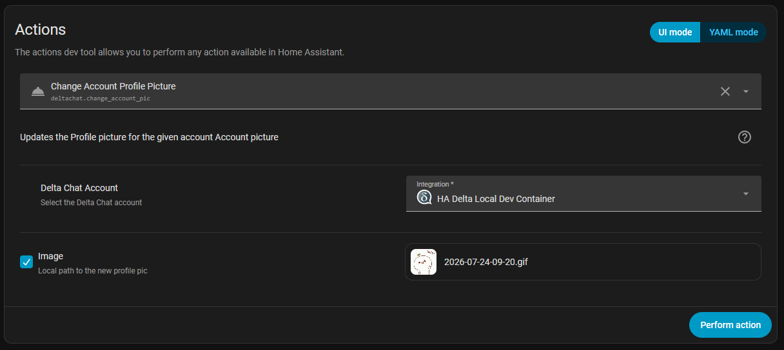

# Ha-DeltaChat Release Changelog

# Release 0.0.7

> **Disclaimer**
> :exclamation: This is an **alpha** build and may have issues. Please report any issues at https://github.com/uditghai/ha-deltachat/issues

## New Features / Changes
#### Change Profile Pic
* Use Service action below to update the Profile picture for an account
```yaml
action: deltachat.change_account_pic
data:
  from_account: 01FFFFFFFFFFFFFFFFFFFFFFFF
  file:
    media_content_id: media-source://<source>
    media_content_type: image/jpeg
```
Or Using the UI in Developer Tools -> Action

  

* View Profile Pic in Device View
* Updated Documentation

# Release 0.0.6 Changes

> **Disclaimer**
> :exclamation: This is an **alpha** build and may have issues. Please report any issues at https://github.com/uditghai/ha-deltachat/issues

## Breaking Changes
* Removed sensor / entity Fingerprint

## New Features / Changes
* Adding a new image entity to Add contact via QR Code (Device View)
* Show Images / Media received by Delta Chat integration in Home Assistant - Media Tab
* Upgraded `deltachat-rpc-server` from 2.44.0 to 2.56.0

## 🐛 Fixes
* Profile Name and bio are now always fetched from Delta Chat. Removed Bio and Profile from entity configuration.

* Sending and Received images tested for:
	1. Images - jpeg, gif
	1. Video - mp4
	1. Audio (Pending)
* Read and update sw_version from `deltachat-rpc-server`
* Migrated to new model for entity configuration (V2)
* Fixed warning
  ```
  WARNING (MainThread) [homeassistant.helpers.frame] Detected that custom integration 'deltachat' passes a non-string value of type int as hw_version to the device registry at custom_components/deltachat/sensor.py, line 46: async_add_entities(sensors). This will stop working in Home Assistant 2026.12.0, please create a bug report at https://github.com/uditghai/ha-deltachat/issues
  ```
* Updated Documentation
  * Read me
  * Release Notes
  * Setting up Dev environment

## Known Issues
* #5 "Last Command" and " Last Message" Sensor not getting updated when a command or a message is received.
* Test sending of additional media types like audio etc
